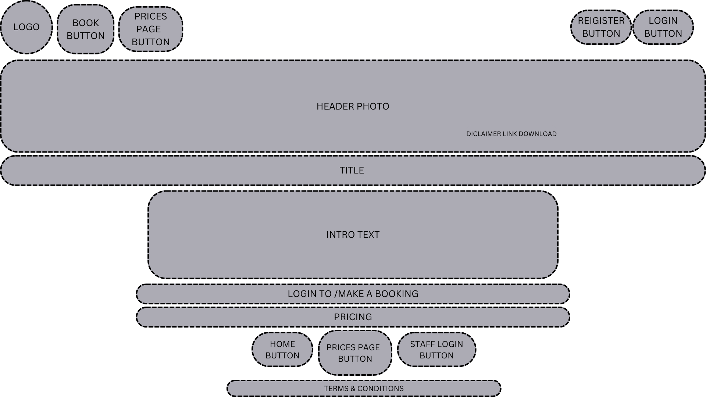
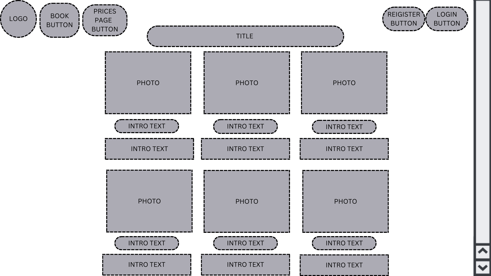
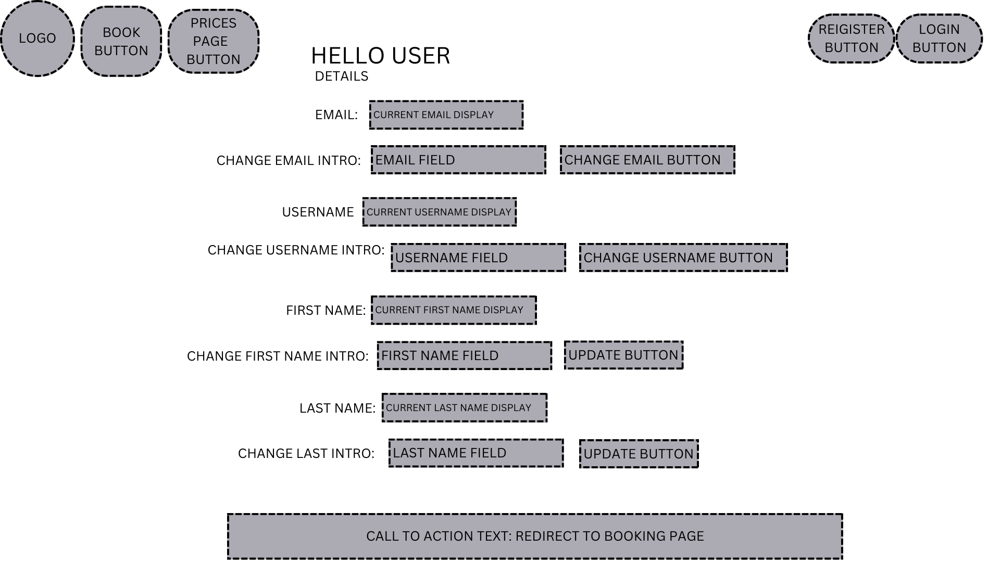
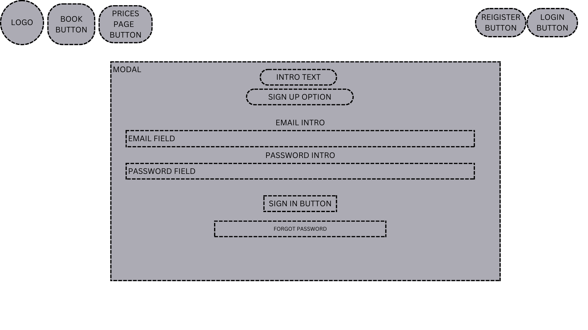
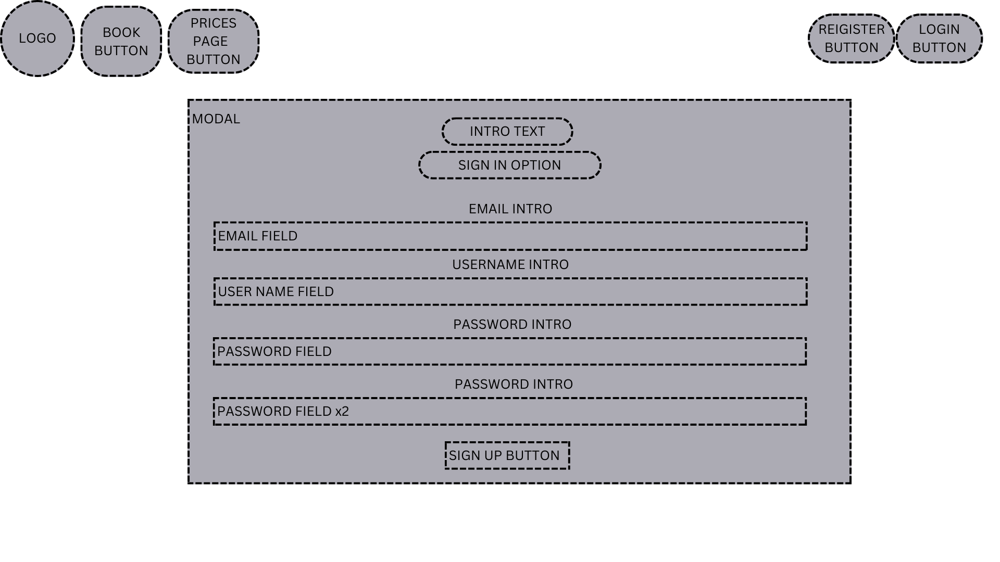
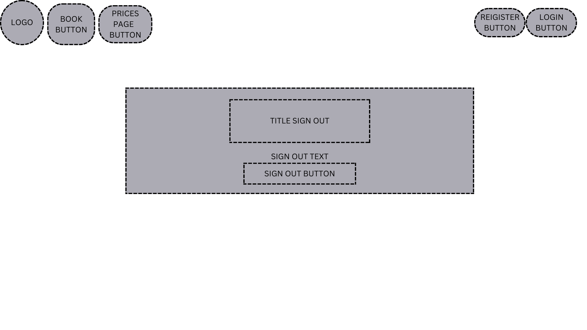

# Lake Meatgrinder Rentals 

This rental company is fortunately fictional and follows a strict businessplan to ensure the predator wildlife of the ecosystem by feeding happy paying tourist to them. The physical part of the store is thought to handle all security policy, payment and local storage. The productstorage of the facility is thought to be endless, as the company recieve thousands of Kayak donations daily from numerous NGO's. This app is designed to make you flick a smile, if that doesn't happen the dev would consider it a failure. 

You'll find the livelink for the site here: 
https://project4-final-c54c1eeb1fef.herokuapp.com/

## Contents

* UX Design
    * User Experience
    * Site Goals
    * Agile Planning
        * Epics
        * User Stories
* Design
    * Typography
    * Images
    * Colours
    * Logo
* Wireframes
* Features
    * General Features
    * Considered Features
    * Accessibility
* Technologies Used
    - Packages
    - Installments
    - Languages
* Deployment
* Testing
* Credits

### User Experience
This content of the site is highly satirical and is not to be taken serious, unless you though Sharknado was a documentary. The landing page contain a small text, stating, you'll might lose your life using the company services: 

User will find a a CTA in the header, and one button closest to the top of the page with Pricing and FAQ page beneath it.

### Site Goals
This site aims to make bookings for kayak and SUP Boards easy for the customer. They do however have to create a profile before booking, this is because the companyowner crave customer information for it to upsell possibly everything. 
The site also grants as a daily booking inventory for the staff. They will have the possibility to update status when recieving customers instore.

## Agile Planning
This project was devoloped using agile methodologies by small sprints, spaced out about 5 weeks. 

Planning was thought out using the MoSCoW-model. This model would stay the benchmark, however assignment of values to userstories varied alot. Priority would change, if difficulty proved excessive and caused time consumption to wander. 

Kanban Board was designed in Jira, but for this project followed in physical example. 

### Epics:
- Epic 1: Basic Setup
    - Make sure django is installed landing page is successfull. 
    - Mapping directory, and creating folders, files etc. 
    - Installing Packages to withhold thought design.
- - -
- Epic 2: Creating users and Admin.
    - Django AllAuth installation
    - Creating Superuser
    - Testing MVT format is responding
- - -
- Epic 3: Creating Models
    - Designing models & Views to fit design
    - Admin creating products
- - -
- Epic 4: Booking, and pricing
    - Displaying admin created content
    - Creating front-end design for the user
    - Back-end design for data
- - -
- Epic 5: Updating Orders
    - CRUD functionality on orders.
    - Staff ordermanagement.
    - Bug solvering
- - -
- Epic 6: Designing endpages:
    - Testing endpoints and designing stand alone pages. 
    - Final touches and bug solvering
    - Responsive design
- - -
- Epic 7: Deployment and Documentation
    -  Deployment
    - Documentation
- - -
- Epic 8: Testing:
    - Manual Testing
    - Testing Documentation
- - - 

### User Stories
### Developer: (Dev)
- As Dev, I need to install/create the project and app files.
- As Dev, I need to setup base/index.html to extend other html files upon.
- As Dev, I need to setup and proove function of static, media and templates files in directories.
- As Dev, I need to Decide on which CDN, and Script to choose and install.
- As Dev, I need to design a Header and footer to suit design ideas. 
- As Dev, I need to install, implement and test Django-Allauth
- As Dev, I need to Update Procfile and Requirements
- As Dev, I need to Use Django DEBUG functions to locate deployment issues.
- As Dev, I need to locate and listen to the Heroku buildlog to adapt requirements.
- As Dev, I need to deploy the final site, without compromising my ability to still edit the app.

### User: (Customer)
- As a Customer, I want to see what this company has to offer. 
- As a Customer, I want to know how to locate and contact this company.
- As a Customer, I want to be able to book at least 1 product for any given timeperiod.
- As a Customer, I would like multiple options of products.
- As a Customer, I would like multiple options of durations.
- As a Customer, I would like a personal login page.
- As a Customer, I would like to be able to change my password if forgotten. 
- As a Customer, I need to be able to view, delete or change my booking.
- As a logged-in user, I can make a booking so that I can reserve activities for one or more guests at a specific date and time, view and update my existing booking/s or delete any existing booking.
- As a site user, I can view essential information so that I can find out about the business hours, contact number, and other important information.
- As a site user, I can view photos so that I get a feel of the atmosphere and what activities are offered.

### Staff and Company Owner
- As the owner, I would like to have a home page with vital information and a obvious CTA
- As the owner, I would like the booking to be as easy and swift as possible to avoid 2nd. thougts.
- As the owner, I want my staff to easily locate bookings with minimum effort. 
- As the owner, I want the customers to pay beforehand to ensure revenue in the business.
- As the owner, I want the contactform to be an endless and troublefull process to minimize claims and returns.
- As the owner, I want my staff to easily edit and manage inventory and products
- As the owner, I want my staff to have CRUD capabilities in the products pages
- As the owner, I want to limit my dependencies to edit site.
- As Staff, I can manage the bookings so that I can create, view, update, and delete any bookings and avoid any double bookings.
- As Staff, I can manage the bookings so that I can create, view, update, and delete any bookings and avoid any double bookings.
- As Staff, I can monitor todays bookings, revenue and customer amount.

### Admin / Superuser
- As an admin, I can manage registered users so that I can monitor and control user access.
- As an admin, I can add or remove details about the business and its surrounding so that the site information stays updated.
- As an admin, I can access stored booking data.

## Design
### Typography
This project utilizes the following fonts:
 - Days One: This font is used across the application for general text. It can be found at 
 - Google Fonts.
Kdam Thmor Pro: This font is also used across the application. It can be found at Google Fonts.

### Img files
Google --> search(x) --> Pictures --> Go to picture website --> Download --> (convert to webp) --> Upload into images folder

### Colors
All colors are taken from bootstrap with small exceptions:

### Logo
Taken from google notorious site 1, when searching for kayak logo.

### Wireframes
I have used CANVA to create the wireframes. Each wireframe stands for the individual .html pages. Boxes are added with words for intent. Subject is to change during the production of this website.

- Home page

- Booking Page

- Pricing page

- About us

- Profile

- Dashboard (admin)

- Login

- Sign up / Register

- Logout

## Features

### Navbar 
The Navbar follow 2 designs, according to user-auth status.

The Navbar is present in all pages, and extends base.html.
- Not logged in: 

This navbar contains following:
- Book here link, it will issue a modal, telling you to log in before you book. 
- Pricing page, a small info about product prior to booking
- About us, link to Faq & Contact page:
- Logo serves as Home/index link

Right side holds Register & Login

- Logged in: (admin)

This navbar contains following:
- Book here, taking you to booking site
- Pricing page, a small info about product prior to booking
- About us, link to Faq & Contact page:
- Logo serves as Home/index link

Right side holds Profile link, and logout button (dashboard will only show if StaffCI, or admin)

### Landing Page / Home Page
A warm welcome awaits you at our Landing page. Here, you'll be introduced to the unique offerings of Lake Ale, including the unparalleled beauty of the world's deepest lake and the adventurous water activities we offer.

A full width hero image with a small amout of text and a CTA, a model will show if user is not logged in, sending the user to login page. If logged in, return booking page. 

A beautiful full generated text to imspire the user to spend some money in the business. 

3 Responsive Buttons added beneath text-part
- Not logged in: 
    - Log in to make a booking
    - Pricing
    - About us

- Logged in: 
    - Make a booking!
    - Pricing
    - About us

**Modal if not logged in:**

### Footer

Footer is made in an elegant and simple design, displaying only 4 items:
- Home, Links to home/index
- Pricing, links to pricing
- Staff Login, this is a link to dashboard, only visuable if Staff/admin
- Terms and conditions

**Key Features**
- A brief introduction to Lake Boatandhoes
- Information about the water activities offered
- Links to Login, Pricing, booking and Contact/Faq page

## Rest of examples will show as admin logged in.

### Pricing Page
This page provides comprehensive information about the pricing details of our services and activities. It's designed to be straightforward and easy to understand, offering guests clarity on their potential expenditure during their adventure. This page also introduces visitors to the wide range of water activities available, providing details about each one.

**Key Features**
- Detailed pricing information for different activities and services
- Detailed descriptions of each water activity offered
- Inspiring visuals and compelling content

### About us Page
Here are 6 relevant questions for the user to know before claiming a booking displayed in a faq box.

- A contact form only added for design purposes
- An adress who’ll take you to Apple Inc in California
- Imaginary email adress and phonenumber.

A MH for a real business, but CH for this particular project. Is the functionality of the form, and ist high in ranking to be done, if time were more fortunate.

### Booking Page
This page displays different products to the user. The user is left with options to check a product, and the choose the amount of people they'd like to bring. 
- Should they choose to only check the box, a value of 1 is automaticly added, and order is issued.
- Would they only type in amount and not check the box, the site will reload, not issue any booking. A nice CouldHave here would be a displayed modal, or message to inform the user, that they made a mistake. 
- At the bottom of the page, user will find a send order button, who ticks a second "are you sure?" confirmation.
- User is then redirected to order confirmation:

**Key Features**
- Full Availability
- Inspiring visuals and compelling content
- Detailed descriptions of each water activity offered
- Detailed pricing information for different activities and services

### Order Confirmation
After making a booking, user will find them here. Displaeyd are following:
- Go to homepage, links to home
- Visit your profile
- Order Summary
- Displayed bookings, with information and price.
- A short information to the user, on how to claim their booking.
- A calculated price total for only this booking.
- Greeting.

### Your / My Profile
The Profile page is definitely the most lacking in UX/UI design. This is due to lack of development pace. Most definitely a need in future updates:

User is greeted with their username. 

In My Details: User will find CRUD functions to change following, but not password.
- Email
- Username
- First & Last Name

At the lower part of site, user will find a table containing their order

They'll have the option to view Orderdetails, "Edit" or delete it. 

Delete button has no second validator, this is due for a future update. 

"Edit will delete their current order, and indulge them to create a new booking, redirecting them straight to booking page."

**No Orders**
User will find information indulging them to book straight away, with a direct link to booking.

**View Details:**
The details accounts for: 
- Order Number
- What is ordered: variant/product
- What user ordered it:
- Booking time and date:
- Total price of this exact booking.
- Only one, rather foolish CTA, indulging the user to delete their order.

### Dashboard
This is Dashboard only accessible from admin & Staff user.

Here the staff will have todays revenue and customer amount displayed. Staff can also update status of the order from None --> Awaiting Pickup --> Delivered. Its believed the staff is capable of using 2nd part billing system to match order ID, amount and status. 

Product: is only used for staff instore.

A nice feature here would be a date-specific ordertable, in order for the staff to find previous bookings. Alongside a status of paid/notpaid maybe a comments section, and a link to Customer details. 

### Login/Register Page
This page provides a user-friendly form where logged-in guests can easily book their desired water activities. It's designed to provide an easy and hassle-free booking experience.

- Design is created thanks to Django Crispy Forms and AllAuth Templates, and all follow same edited design principle. 
    - Login 
    - Sign up
    - Log Out
    - Forgot Password

### Features to include:

## Installs

- pip3 install django
- django-admin startproject main .
- python3 manage.py startapp home
- python3 manage.py startapp staff
- pip3 install django-allauth
### Templates:
- ls ../.pip-modules/lib
- cp -r ../.pip-modules/lib/python3.8/site-packages/allauth/templates/* ./templates
### Superuser / admin:
- python3 manage.py createsuperuser
### Crispy forms:
- pip3 install django-crispy-forms
- pip3 install crispy_bootstrap5
- pip3 freeze --local > requirements.txt
### Img management:
- pip3 install pillow

