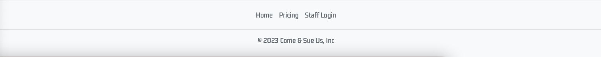

# Lake Ale Rentals

This rental company is completely fictional. The physical part of the store is thought to handle all security policy, payment and local storage. The productstorage of the facility is thought to be endless, as the company recieve thousands of Kayak donations daily from numerous NGO's.


You'll find the livelink for the site here: 
[Lake Ale Rentals](https://project4-final-c54c1eeb1fef.herokuapp.com/)


## Contents

* [UX Design](#UX-Design)
    * [User Experience](#User-Experience)
    * [Requirements](#requirements)
    * [Site Goals](#Site-Goals)
    * [Agile Planning](#Agile-planning)
        * [Epics](#epics)
        * [User Stories](#user-stories)
* [Design](#design)
    * [Typography](#typography)
    * [Images](#img)
    * [Colours](#colours)
    * [Logo](#logo)
* [Wireframes](#wireframes)
* [Features](#features)
    * [Navbar](#navbar)
    * [Landing page / Home Page](#landandhomepage)
    * [Footer](#Footer)
    * [Pricing Page](#pricing)
    * [About Us](#About-us)
    * [Booking Page](#booking)
    * [Your / My Profile](#profile)
    * [Dashboard](#dashboard)
    * [Login / Register page](#loginregister-page)
    * [Future Features:](#future-features)

* [Technologies](#technologies)
* [Deployment](#deployment)
* [Testing](#testing)
* [Credits](#credits)

## [UX Design](#UX-Design)

### [User Experience](#User-Experience)
This content of the site is highly satirical and is not to be taken serious, unless you though Sharknado was a documentary. The landing page contain a small text, stating, you'll might lose your life using the company services: 

User will find a a CTA in the header, and one button closest to the top of the page with Pricing and FAQ page beneath it.

### [Site Goals](#Site-Goals)
This site aims to make bookings for kayak and SUP Boards easy for the customer. They do however have to create a profile before booking, this is because the companyowner crave customer information for it to upsell possibly everything. 
The site also grants as a daily booking inventory for the staff. They will have the possibility to update status when recieving customers instore.

## [Agile Planning](#Agile-planning)
This project was devoloped using agile methodologies by small sprints, spaced out about 5 weeks. 

Planning was thought out using the MoSCoW-model. This model would stay the benchmark, however assignment of values to userstories varied alot. Priority would change, if difficulty proved excessive and caused time consumption to wander. 

Kanban Board was designed in Jira.


I have chosen to set up my Kanban board with the following columns to facilitate an organized and efficient development process:
* To Do:

I use the "To Do" column as the starting point on the board. This column represents the backlog or the pool of work that needs to be done. It includes all the tasks, user stories, or requirements that are yet to be picked up or started by team members. By having a clear list of tasks in the "To Do" column, I can easily prioritize and plan the team's workload.
* In Progress:

In the "In Progress" column, I track tasks or user stories that are currently being worked on by team members. Once a team member starts working on a task, it is moved from the "To Do" column to the "In Progress" column. This column provides visibility into what is actively being worked on and helps avoid conflicts or duplication of efforts.
* Testing:

I have included the "Testing" column to ensure that tasks or user stories have a dedicated stage for quality assurance. When a task is completed by the development team, it is moved to the "Testing" column. This stage helps to validate that the work done meets the required standards and that the functionality is working as expected before moving forward.
* Done:

The "Done" column represents tasks or user stories that have successfully passed through all the development stages, including testing, and are ready for deployment or delivery. Having a "Done" column allows me to easily track completed tasks and measure the team's progress towards project goals.
* On Hold:

The "On Hold" column is useful for tasks or user stories that cannot be progressed further at the moment due to various reasons. It could be waiting for additional information, external dependencies, or a decision from stakeholders. By having this column, I can keep track of any potential roadblocks and ensure nothing is forgotten.

### [Epics](#epics)
- Epic 1: Basic Setup
    - Make sure django is installed landing page is successfull. 
    - Mapping directory, and creating folders, files etc. 
    - Installing Packages to withhold thought design.
- - -
- Epic 2: Creating users and Admin.
    - Django AllAuth installation
    - Creating Superuser
    - Testing MVT format is responding
- - -
- Epic 3: Creating Models
    - Designing models & Views to fit design
    - Admin creating products
- - -
- Epic 4: Booking, and pricing
    - Displaying admin created content
    - Creating front-end design for the user
    - Back-end design for data
- - -
- Epic 5: Updating Orders
    - CRUD functionality on orders.
    - Staff ordermanagement.
    - Bug solvering
- - -
- Epic 6: Designing endpages:
    - Testing endpoints and designing stand alone pages. 
    - Final touches and bug solvering
    - Responsive design
- - -
- Epic 7: Deployment and Documentation
    -  Deployment
    - Documentation
- - -
- Epic 8: Testing:
    - Manual Testing
    - Testing Documentation
- - - 


## [User Stories](#user-stories)

### User: (Customer)
- As a Customer, I want to see what this company has to offer. 
- As a Customer, I want to know how to locate and contact this company.
- As a Customer, I want to be able to book at least 1 product for any given timeperiod.
- As a Customer, I would like multiple options of products.
- As a Customer, I would like multiple options of durations.
- As a Customer, I would like a personal login page.
- As a Customer, I would like to be able to change my password if forgotten. 
- As a Customer, I need to be able to view, delete or change my booking.
- As a logged-in user, I can make a booking so that I can reserve activities for one or more guests at a specific date and time, view and update my existing booking/s or delete any existing booking.
- As a site user, I can view essential information so that I can find out about the business hours, contact number, and other important information.
- As a site user, I can view photos so that I get a feel of the atmosphere and what activities are offered.


### Staff and Company Owner
- As the owner, I would like to have a home page with vital information and a obvious CTA
- As the owner, I would like the booking to be as easy and swift as possible to avoid 2nd. thougts.
- As the owner, I want my staff to easily locate bookings with minimum effort. 
- As the owner, I want the customers to pay beforehand to ensure revenue in the business.
- As the owner, I want my staff to easily edit and manage inventory and products
- As Staff, I can manage the bookings so that I can create, view, update, and delete any bookings and avoid any double bookings.
- As Staff, I can monitor todays bookings, revenue and customer amount.


### Admin / Superuser
- As an admin, I can manage registered users so that I can monitor and control user access.
- As an admin, I can add or remove details about the business and its surrounding so that the site information stays updated.
- As an admin, I can access stored booking data.


## [Requirements](#requirements)

### Developer: (Dev)
- As Dev, I need to install/create the project and app files.
- As Dev, I need to setup base/index.html to extend other html files upon.
- As Dev, I need to setup and proove function of static, media and templates files in directories.
- As Dev, I need to Decide on which CDN, and Script to choose and install.
- As Dev, I need to design a Header and footer to suit design ideas. 
- As Dev, I need to install, implement and test Django-Allauth
- As Dev, I need to Update Procfile and Requirements
- As Dev, I need to Use Django DEBUG functions to locate deployment issues.
- As Dev, I need to locate and listen to the Heroku buildlog to adapt requirements.
- As Dev, I need to deploy the final site, without compromising my ability to still edit the app.

## [Design](#design)
 
### [Typography](#typography)
This project utilizes the following fonts:
 - Days One: This font is used across the application for general text. It can be found at 
 - Google Fonts.
Kdam Thmor Pro: This font is also used across the application. It can be found at Google Fonts.

### [Images](#img)
Google --> search(x) --> Pictures --> Go to picture website --> Download --> (convert to webp) --> Upload into images folder

### [Colours](#colours)
All colors are taken from bootstrap with small exceptions:


### [Logo](#logo)
Taken from google notorious site 1, when searching for kayak logo.


### [Wireframes](#wireframes)
I have used CANVA to create the wireframes. Each wireframe stands for the individual .html pages. Boxes are added with words for intent. Subject is to change during the production of this website.


- Home page


- Booking Page


- Pricing page


- About us


- Profile


- Dashboard (admin)


- Login


- Sign up / Register


- Logout


## [Features](#features)

### [Navbar](#navbar) 
The Navbar follow 2 designs, according to user-auth status.

The Navbar is present in all pages, and extends base.html.
- Not logged in: 


This navbar contains following:
- Book here link, it will issue a modal, telling you to log in before you book. 
- Pricing page, a small info about product prior to booking
- About us, link to Faq & Contact page:
- Logo serves as Home/index link

Right side holds Register & Login

- Logged in: (admin)


This navbar contains following:
- Book here, taking you to booking site
- Pricing page, a small info about product prior to booking
- About us, link to Faq & Contact page:
- Logo serves as Home/index link

Right side holds Profile link, and logout button (dashboard will only show if StaffCI, or admin)

### [Landing page / Home Page](#landandhomepage)
A warm welcome awaits you at our Landing page. Here, you'll be introduced to the unique offerings of Lake Ale, including the unparalleled beauty of the world's deepest lake and the adventurous water activities we offer.

A full width hero image with a small amout of text and a CTA, a model will show if user is not logged in, sending the user to login page. If logged in, return booking page. 

A beautiful full generated text to imspire the user to spend some money in the business. 

3 Responsive Buttons added beneath text-part
- Not logged in: 
    - Log in to make a booking
    - Pricing
    - About us


- Logged in: 
    - Make a booking!
    - Pricing
    - About us

**Modal if not logged in:**


### [Footer](#Footer)

Footer is made in an elegant and simple design, displaying only 4 items:
- Home, Links to home/index
- Pricing, links to pricing
- Staff Login, this is a link to dashboard, only visuable if Staff/admin
- Terms and conditions





**Key Features**
- A brief introduction to Lake Boatandhoes
- Information about the water activities offered
- Links to Login, Pricing, booking and Contact/Faq page

## Rest of examples will show as admin logged in.

### [Pricing Page](#pricing)
This page provides comprehensive information about the pricing details of our services and activities. It's designed to be straightforward and easy to understand, offering guests clarity on their potential expenditure during their adventure. This page also introduces visitors to the wide range of water activities available, providing details about each one.


**Key Features**
- Detailed pricing information for different activities and services
- Detailed descriptions of each water activity offered
- Inspiring visuals and compelling content

### [About Us](#About-us)
Here are 6 relevant questions for the user to know before claiming a booking displayed in a faq box.

- A contact form only added for design purposes
- An adress who’ll take you to Apple Inc in California
- Imaginary email adress and phonenumber.

A MH for a real business, but CH for this particular project. Is the functionality of the form, and ist high in ranking to be done, if time were more fortunate.


### [Booking Page](#booking)
This page displays different products to the user. The user is left with options to check a product, and the choose the amount of people they'd like to bring. 
- Should they choose to only check the box, a value of 1 is automaticly added, and order is issued.
- Would they only type in amount and not check the box, the site will reload, not issue any booking. A nice CouldHave here would be a displayed modal, or message to inform the user, that they made a mistake. 
- At the bottom of the page, user will find a send order button, who ticks a second "are you sure?" confirmation.
- User is then redirected to order confirmation:


**Key Features**
- Full Availability
- Inspiring visuals and compelling content
- Detailed descriptions of each water activity offered
- Detailed pricing information for different activities and services

### Order Confirmation
After making a booking, user will find them here. Displaeyd are following:
- Go to homepage, links to home
- Visit your profile
- Order Summary
- Displayed bookings, with information and price.
- A short information to the user, on how to claim their booking.
- A calculated price total for only this booking.
- Greeting.


### [Your / My Profile](#profile)
The Profile page is definitely the most lacking in UX/UI design. This is due to lack of development pace. Most definitely a need in future updates:

User is greeted with their username. 

In My Details: User will find CRUD functions to change following, but not password.
- Email
- Username
- First & Last Name

At the lower part of site, user will find a table containing their order


They'll have the option to view Orderdetails, "Edit" or delete it. 

Delete button has no second validator, this is due for a future update. 

"Edit will delete their current order, and indulge them to create a new booking, redirecting them straight to booking page."


**No Orders**
User will find information indulging them to book straight away, with a direct link to booking.


**View Details:**
The details accounts for: 
- Order Number
- What is ordered: variant/product
- What user ordered it:
- Booking time and date:
- Total price of this exact booking.
- Only one, rather foolish CTA, indulging the user to delete their order.


### [Dashboard](#dashboard)
This is Dashboard only accessible from admin & Staff user.

Here the staff will have todays revenue and customer amount displayed. Staff can also update status of the order from None --> Awaiting Pickup --> Delivered. Its believed the staff is capable of using 2nd part billing system to match order ID, amount and status. 

Product: is only used for staff instore.

A nice feature here would be a date-specific ordertable, in order for the staff to find previous bookings. Alongside a status of paid/notpaid maybe a comments section, and a link to Customer details. 


### [Login / Register page](#loginregister-page)
This page provides a user-friendly form where logged-in guests can easily book their desired water activities. It's designed to provide an easy and hassle-free booking experience.

- Design is created thanks to Django Crispy Forms and AllAuth Templates, and all follow same edited design principle. 
    - Login 
    - Sign up
    - Log Out
    - Forgot Password


### [Future Features:](#future-features)
- Error pages:
- Booking
    - Second confirmation in booking
    - Allow User to fully their current order
    - Require date for booking
- Advanced Dashboard for Staff:
    - Full Crud functions for all orders.
    - Historic database for orders
- Payment in app
- Allow staff to add new products. 
- User Authentication:
    - Allow user to delete account
    - Allow Change of password
    - Improved UI

## [Technologies](#technologies)
- HTML 
    Structure of the Website has HTML as the main language.
- CSS 
    External style.css file for extra styling
- JavaScript
    - Only Added bootstrap js.script added inline.
- Python
    - Django was used alongside Python for functionality 
- Git, GitHub & Gitpod
    - Used to source, commit, push and devolop this project.
- Canva 
    - Used to create Wireframes
- Google Fonts and Icons
    - Used for additional styling
- Jira (Premium)
    Used as Agile Project Management tool
- Heroku
    - Used to host 
- Bootstrap5, Getbootstrap and Bootstrap MDB
    - For quick and easy styling and design

**Installments**
- pip3 install django
- django-admin startproject main .
- python3 manage.py startapp home
- python3 manage.py startapp staff
- pip3 install django-allauth
- pip3 install django-gunicorn
### Templates:
- ls ../.pip-modules/lib
- cp -r ../.pip-modules/lib/python3.8/site-packages/allauth/templates/* ./templates
### Superuser / admin:
- python3 manage.py createsuperuser
### Crispy forms:
- pip3 install django-crispy-forms
- pip3 install crispy_bootstrap5
- pip3 freeze --local > requirements.txt
### Img management:
- pip3 install pillow + Media file
### Hosting:
- Install Whitenoise
- Change of backport: backports.zoneinfo==0.2.1;python_version<"3.9"

**Requirements:**
- pip3 freeze --local > requirements.txt
- asgiref==3.7.2
- backports.zoneinfo==0.2.1;python_version<"3.9"
- crispy-bootstrap5==0.7
- Django==4.2.3
- django-allauth==0.54.0
- django-crispy-forms==2.0
- gunicorn==21.2.0
- oauthlib==3.2.2
- Pillow==10.0.0
- PyJWT==2.8.0
- python3-openid==3.2.0
- requests-oauthlib==1.3.1
- sqlparse==0.4.4
- whitenoise==6.5.0

## [Deployment](#deployment)

### Version Control

The site was created using VS Code, web IDE by gitpod and pushed to github to the repository 'pp4-this-time-final'.

The following git commands were used throughout development to push code to the remote repo:

```git add .``` - This command was used to add the file(s) to the staging area before they are committed.

```git commit -m “commit message”``` - This command was used to commit changes to the local repository queue ready for the final step.

```git push``` - This command was used to push all committed code to the remote repository on github.

### Heroku Deployment

The site was deployed to Heroku. The steps to deploy are as follows:

- Navigate to heroku and create an account
- Click the new button in the top right corner
- Select create new app
- Enter app name
- Select region and click create app
- Click the resources tab and search for Heroku Postgres
- Select hobby dev and continue
- Go to the settings tab and then click reveal config vars
- Add the following config vars:
    - DISABLE_COLLECTSTATIC : 1
- Click the deploy tab
- Scroll down to Connect to GitHub and sign in / authorize when prompted
- In the search box, find the repositoy you want to deploy and click connect
- Scroll down to Manual deploy and choose the main branch
- Click deploy

The app should now be deployed.

The live link can be found here: [Live Site](https://project4-final-c54c1eeb1fef.herokuapp.com/)

## [Testing](#testing)

Please find the carried out testing on [testing.md](testing.md).

## [Credits](#credits)

This project has been completed with help from following: 
- [Django Documentation](https://docs.djangoproject.com/en/4.2/)
- [Bootstrap 5.3](https://getbootstrap.com/docs/5.3/getting-started/introduction/)
- [W3Schools](https://www.w3schools.com/)
- [Stackoverflow](https://stackoverflow.com/)
- AllAuth from Code Institutes "I think before I Blog"
- Youtube (list of channels)
    - [Dennis Ivy](https://www.youtube.com/@DennisIvy)
    - [The Net Ninja](https://www.youtube.com/@NetNinja)
    - [Traversy Media](https://www.youtube.com/@TraversyMedia)
    - [FreeCodeCamp](https://www.youtube.com/@freecodecamp)
    - [Legion Script](https://www.youtube.com/@LegionScript)
    - [Programming with Mosh](https://www.youtube.com/@programmingwithmosh)
    - [Code Affection](https://www.youtube.com/@CodAffection)
- Tutor assistance in deployment


